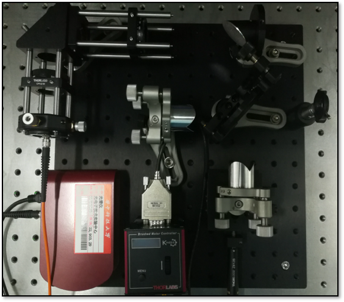
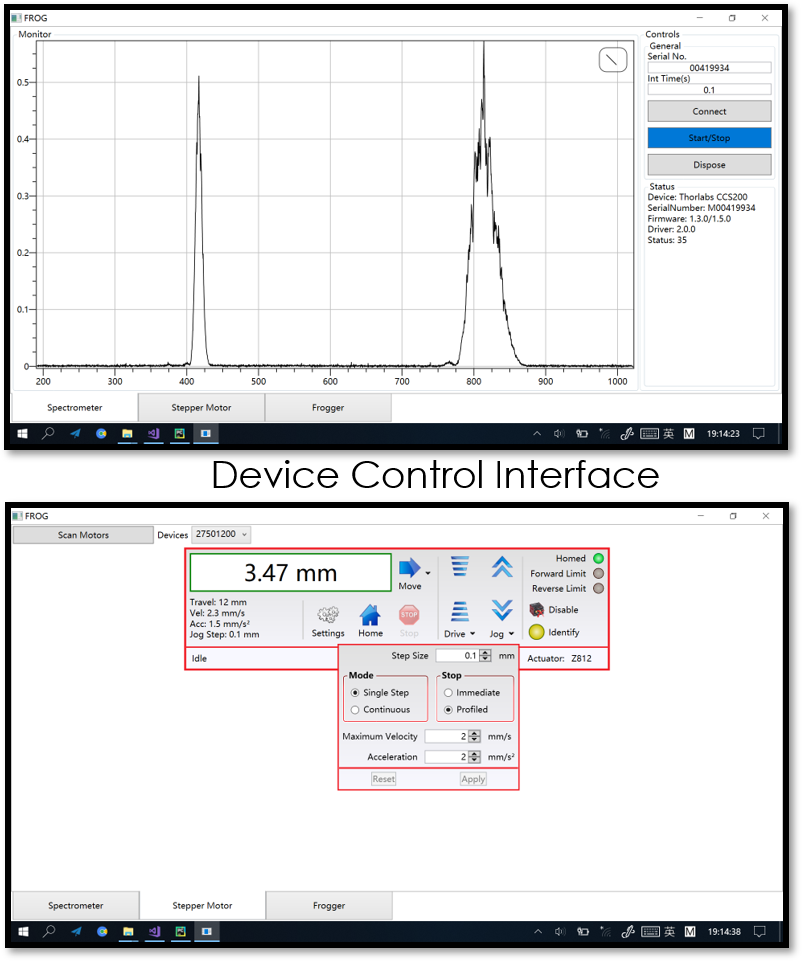
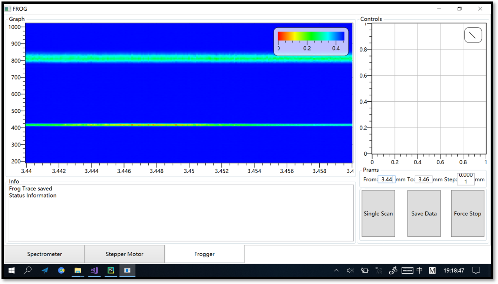
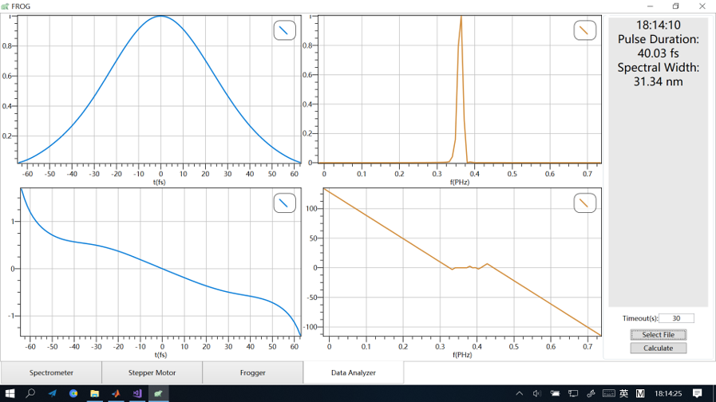
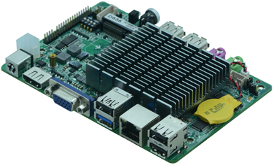
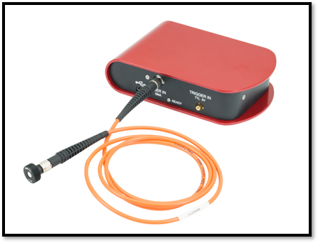
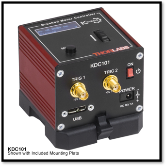

# Embedded Software-Assisted Frequency Resolved Optical Gating (FROG)
An upstream GUI controlling the whole FROG system for my under graduate project.
# UI & Sceeenshots

# Hardware

Intel® Atom Z8350(AMD64 4-core@1.44GHz upto 1.8GHz) develop board

Thorlabs® CCS200 (Compact CCD Spectremeter, 200nm~1000nm)

Thorlabs® KDC101 (KCube DCservo) with Z812B Translation Stage

Develop Environment: Windows 10 (Build 1803) .Net Framework 4.6.1 or higher.

# Additional drivers and references from Thorlabs®

OSA: https://www.thorlabs.com/software_pages/ViewSoftwarePage.cfm?Code=OSA

Stepper Motors: https://www.thorlabs.com/software_pages/ViewSoftwarePage.cfm?Code=Motion_Control
